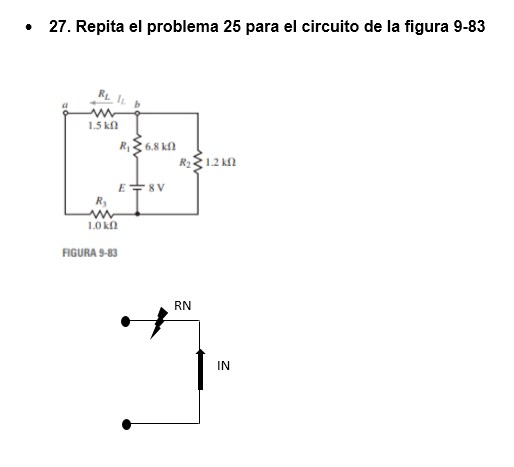

# InformeTarea5
==========================
## DEBER CAPITULOS 9 y 10
1. OBJETIVOS
* 1.1. OBJETIVO GENERAL
* Experimentar con los elementos de medida básicos desde el punto de vista eléctrico y su aplicación en circuitos. El conocimiento  de los distintos métodos de resolución de los circuitos eléctricos, así como el estudio de la relación existente entre mallas, nodos corrientes y voltaje.

* 1.2. OBJETIVOS ESPECÍFICOS
  *	Practicar los distintos métodos de resolución de circuitos.
  * Conocer el funcionamiento de los elementos eléctricos.
  * Reconocer los elementos que conforman un circuito eléctrico.
  *	Comprender la teoría de cada método de resolución 

2. MARCO TEÓRICO (RESUMEN)

3. EXPLICACIÓN Y RESOLUCIÓN DE EJERCICIOS O PROBLEMAS

Resolución del capitulo 9 (ejercicios impares)

Resolución del capitulo 10 (ejercicios pares)

4. VIDEO

https://youtu.be/6LWmK6q9f7Y

5. CONCLUSIONES

El trabajo realizado para la resolución del deber ha sido muy provechosa por varias razones, las cuales se resumen en esta conclusión. En primer lugar, se ha practicado el uso de los diferentes tipos de teoremas de redes y se empezo a estudiar sobre los capacitores y su capacitancia.

También se pudo ampliar el concepto analisis por computadora estableciendo relaciones entre estos valores en base a los ejercicios con los que se están trabajando en este deber. Un aprendizaje muy valioso que se obtuvo de este trabajo es que se tiene la forma en que se aplicaron los conceptos y propiedades que nos brindó el libro de Análisis de Circuitos de los capítulos 9 y 10 que fueron comprobadas, por medio de la resolución de los ejercicios. Se ha cumplido con los objetivos propuestos para este trabajo, y se desea que este reporte sea de provecho para aquellos que próximamente aplique sus conceptos.

6. BIBLIOGRAFÍA

Allan.H.Wilhelm.C.(2008). Análisis de circuitos teoría y práctica. Santa Fe, México: Cengage learning editores.
